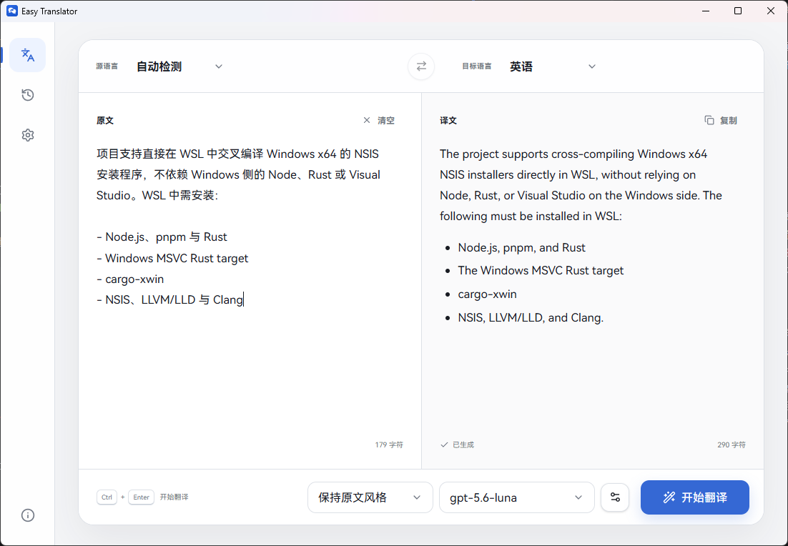
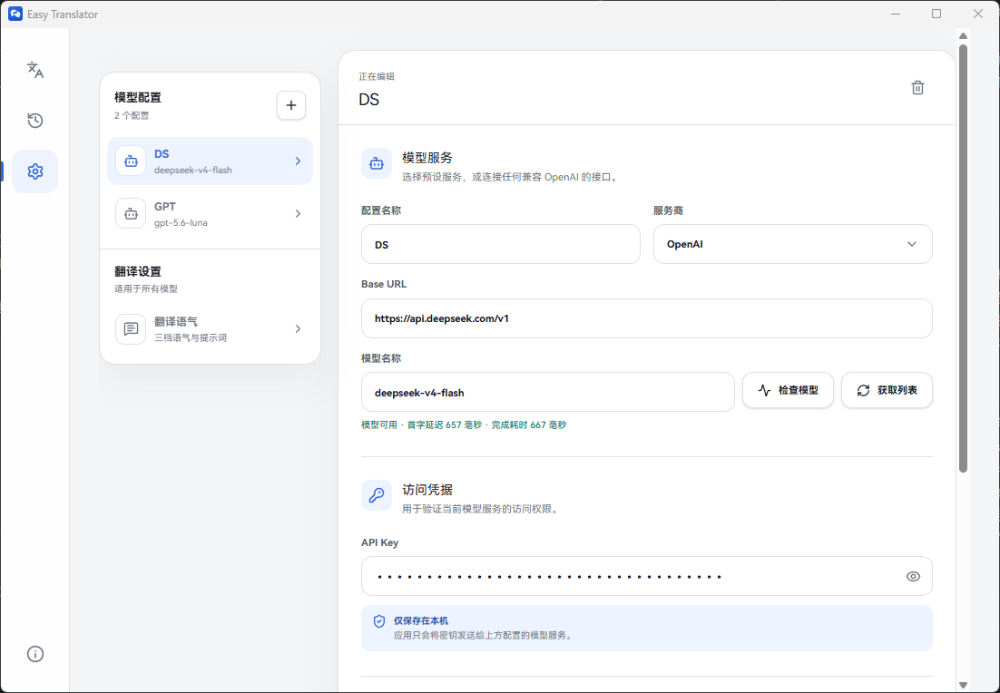

<p align="center">
  
</p>

<h1 align="center">Easy Translator</h1>

<p align="center">一款简洁、专注的 AI 桌面翻译工具。</p>

Easy Translator 可以连接 OpenAI、DeepSeek、通义千问以及其他兼容 OpenAI 接口的模型服务，提供流式翻译、多模型配置、语气调整和本地历史记录。

> 使用前需要准备可用的模型服务、API Key 和模型名称。Easy Translator 本身不提供模型额度。



*自动识别中文内容并翻译为英文，译文以流式方式生成。*

## 主要功能

- **自动选择中英目标语言**：源语言设为“自动检测”时，输入中文自动译为英文，输入非中文内容自动译为中文。
- **多种语言**：支持中文、英语、日语、韩语、法语、德语和西班牙语之间的翻译。
- **兼容多种模型服务**：内置 OpenAI、DeepSeek、通义千问预设，也可填写自定义 OpenAI 兼容接口。
- **多模型配置**：保存多个模型配置，在翻译页快速切换。
- **模型可用性检查**：通过一次简短请求检查模型能否响应，并显示首字延迟与完成耗时。
- **翻译语气**：提供口语化、学术化和保持原文风格三档设置，支持自行修改提示词。
- **流式输出与格式保留**：译文实时生成，并支持常见 Markdown 格式。
- **本地历史记录**：自动保留最近 200 条翻译，可搜索、复制、删除或再次使用。

## 下载与安装

当前项目提供 Windows x64 安装包的构建支持。可前往 [GitHub Releases](https://github.com/Aye10032/easy-translator/releases) 查看可下载版本。

1. 下载名称以 `-setup.exe` 结尾的安装程序。
2. 运行安装程序并按照提示完成安装。
3. 首次启动时，如果系统缺少 Microsoft Edge WebView2 Runtime，安装程序会联网下载。

如果发布页暂时没有适合的安装包，也可以按照本文末尾的“从源码运行”自行构建。

## 首次配置

安装完成后，需要先添加模型配置：

1. 打开左侧的 **模型设置**。
2. 选择 OpenAI、DeepSeek、通义千问或自定义兼容接口。
3. 确认 **Base URL**。自定义接口通常需要包含 `/v1`，具体以服务商文档为准。
4. 填写 **API Key** 和 **模型名称**。
5. 可点击 **获取列表**，从服务端返回的模型中选择；也可以直接填写模型名称。
6. 点击 **检查模型**，确认模型可用并查看响应耗时。
7. 点击 **保存更改**。



*模型检查会验证实际响应，并显示首字延迟与完成耗时。*

“获取列表”依赖服务端提供 OpenAI 格式的 `/models` 接口。如果获取失败，但你已经知道正确的模型名称，可以手动填写后直接使用“检查模型”。

## 开始翻译

1. 回到左侧的 **翻译** 页面。
2. 输入或粘贴原文。
3. 选择源语言和目标语言，或将源语言保留为“自动检测”。
4. 在底部选择翻译语气和模型配置。
5. 点击 **开始翻译**，或按 `Ctrl + Enter`。
6. 生成完成后，可以复制译文；本次内容会自动保存到本地历史记录。

### 自动目标语言

仅当源语言为“自动检测”时，应用会在本地根据输入内容切换目标语言：

- 输入包含中文正文：目标语言设为英语。
- 输入不属于中文：目标语言设为中文。
- 输入为空：保持当前目标语言不变。
- 手动指定源语言：停止自动切换目标语言。

这项判断在本机即时完成，不会为了识别语言而单独发送网络请求。

## 模型与翻译偏好

### 管理多个模型

在模型设置左侧点击 `+` 可以新建配置。每个配置分别保存服务商、Base URL、模型名称、思索设置和 API Key。翻译页底部可以直接切换已经保存的配置。

### 思索设置

对于支持推理能力的模型，可以开启思索并选择低、中、高三档深度。服务商或模型不支持相关参数时，请关闭该选项。

### 翻译语气

- **口语化表达**：偏向自然、地道、易读的日常语言。
- **学术化表达**：偏向正式、严谨和术语准确的表达。
- **保持原文风格**：尽量延续原文的语域、正式程度和情绪。

三档语气的提示词都可以在模型设置页的“翻译语气”中修改。

## 历史记录

成功完成的翻译会自动保存在本机，最多保留 200 条。历史记录页面支持：

- 搜索原文或译文；
- 查看翻译时间、语言方向和所用模型；
- 复制原文或译文；
- 将历史内容重新带回翻译页面；
- 删除单条记录或清空全部记录。

## 数据与隐私

- 模型配置、API Key、翻译偏好和历史记录保存在应用的本地数据目录中。
- API Key 不会由 Easy Translator 上传到自有服务器，但调用模型时会作为鉴权信息发送到你配置的模型服务。
- 原文会发送到你选择的模型服务进行翻译，请确认所用服务的隐私政策，并谨慎处理敏感内容。
- 使用自定义 Base URL 时，请确保该地址来自可信服务。

## 常见问题

### 点击“开始翻译”后提示失败

先前往模型设置点击“检查模型”。同时确认 Base URL、API Key 和模型名称正确，并检查当前网络能否访问模型服务。

### 为什么“获取列表”失败，但接口仍可能可用？

部分兼容接口没有实现 `/models`，或禁止当前密钥访问该接口。可以手动填写模型名称，再使用“检查模型”验证实际聊天请求。

### 翻译响应很慢

使用“检查模型”查看首字延迟和总耗时。延迟通常受模型类型、服务商负载、网络状况以及思索深度影响。

### API Key 会被同步到云端吗？

Easy Translator 当前没有账号或云同步功能。密钥保存在本机，仅在请求你配置的模型服务时使用。

## 从源码运行

以下内容面向希望参与开发或自行构建的用户。

### 环境要求

- Node.js 与 pnpm
- Rust 工具链
- Tauri 2 所需的系统依赖

### 本地开发

```bash
pnpm install
pnpm tauri dev
```

### 构建当前平台安装包

```bash
pnpm tauri build
```

### 在 WSL 构建 Windows x64 安装包

项目支持在 WSL 中交叉编译 Windows x64 的 NSIS 安装程序，不依赖 Windows 侧的 Node.js、Rust 或 Visual Studio。

首次准备环境：

```bash
sudo apt update
sudo apt install nsis llvm lld clang
rustup target add x86_64-pc-windows-msvc
cargo install --locked cargo-xwin
```

执行构建：

```bash
pnpm bundle:windows
```

安装包位于：

```text
src-tauri/target/x86_64-pc-windows-msvc/release/bundle/nsis/
```

WSL 交叉编译支持 NSIS `-setup.exe`，不支持 WiX `.msi`。

## 技术栈

- Tauri 2
- React 19
- TypeScript
- Vite
- Vercel AI SDK

## 项目地址

[github.com/Aye10032/easy-translator](https://github.com/Aye10032/easy-translator)
